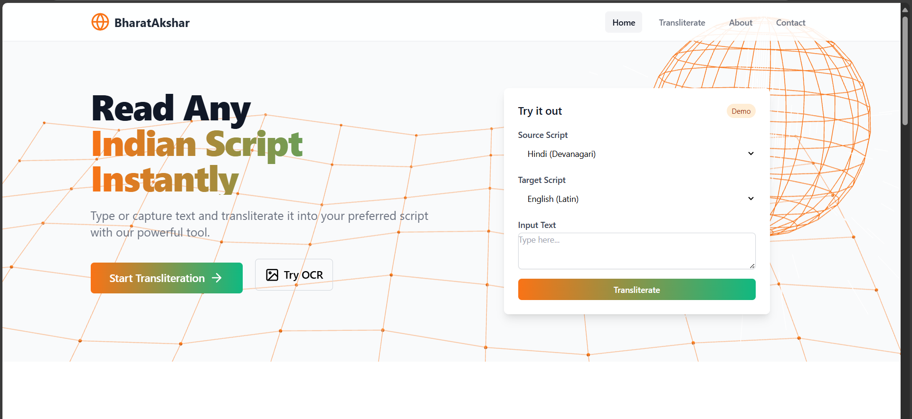
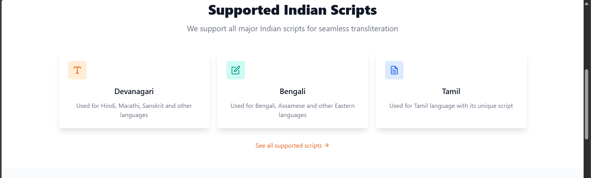
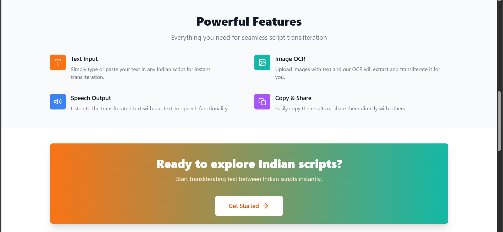
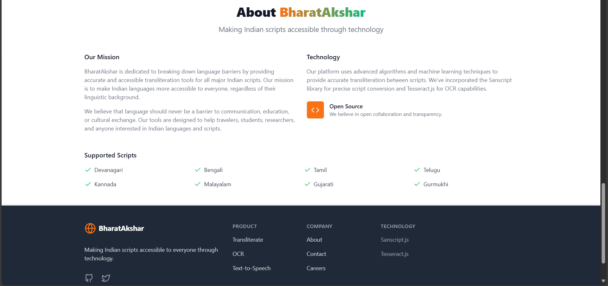
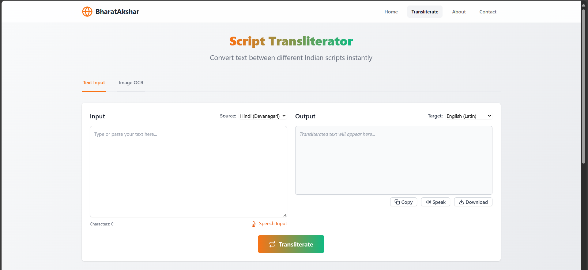
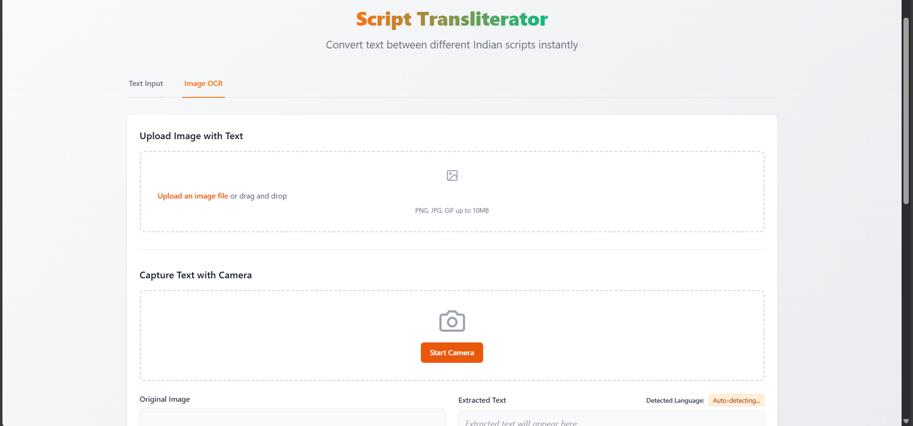

# BharatAkshar

BharatAkshar is a web application designed to transliterate text between Indian scripts. Users can either point their phone camera at a street sign or upload a photo, and the app will recognize the text using Optical Character Recognition (OCR). The script is automatically detected, and the text is converted into the user's preferred script without altering meaning or pronunciation.

This ensures that names of places and other text look different in writing but sound the same when read aloud, making it easy for travelers to read local signboards clearly.

---

## **Problem It Solves**

Traveling to another state in India can make reading local boards challenging due to unfamiliar scripts. BharatAkshar addresses this problem by:

- Displaying text in a script the user already knows.
- Saving time and reducing stress when understanding unknown scripts.
- Preserving pronunciation so names of places are spoken correctly.
- Making travel smoother and more comfortable for frequent travelers.

---

## **Innovation & Uniqueness**

- Unlike translation apps, BharatAkshar keeps the original meaning and pronunciation intact by only changing the script.
- Supports multiple Indian scripts in a single app — a rare feature.
- Real-time conversion using a phone camera (camera functionality in progress).
- Works on both web and mobile platforms.

---

## **Features**

- Supports multiple Indian languages for transliteration.
- Converts typed or scanned text into the chosen script.
- Speaks out text using text-to-speech functionality.
- Easy-to-use interface for fast and accurate conversion.

---

## **Current Status**

- Web prototype available with all features except real-time camera functionality (in progress).

---

## **Team Details**

| Role | Name |
|------|------|
| Team Name | CodeSynergy |
| Team Leader & Concept Originator | K. Nandu |
| Lead Developer (Web/Prototype) | K. Shiva Kumar |
| Presentation Design & Documentation | Gurutej |
| Presentation & Communication | B. Drithika, B. Thriveni, D. Nandhitha |

---

## **How to Use**

1. Open the website in a browser.
2. Upload a text image or type text in the input field.
3. Choose your preferred script.
4. View the converted text and optionally listen using text-to-speech.

---

## **Future Work**

- Integrate camera functionality for real-time transliteration of street signs.
- Expand support for additional Indian scripts and languages.
- Improve UI/UX for better mobile responsiveness.
- Enhance OCR accuracy, transliteration quality, and text-to-speech pronunciation.

---

## **Demo & Screenshots**

### Web Prototype

### Camera Functionality (in progress)

---

## **Deployment**

The project is deployed using GitHub Pages:

👉 [BharatAkshar Live Demo](https://kanneboinashivakumar.github.io/BharatAkshar/)  

---

## **Issues**

If you encounter any problems or bugs, please create an issue on GitHub. Examples of issues include:

- OCR does not extract text correctly for certain scripts (e.g., Bengali, malayalam etc..).
- Long sentences are not transliterated properly for some scripts.
- Text-to-speech pronunciation is inaccurate for english.
- UI/UX issues or bugs with camera functionality.

When reporting an issue, please provide:
1. Language/script used.
2. Sample text or image if possible.
3. Steps to reproduce the issue.
4. Expected vs actual behavior.

---

## **Contributing**

We welcome contributions from the community! 🙌

Ways you can contribute:

1. **Improve OCR accuracy**
   - Fix issues with incorrect text extraction for languages like Bengali etc.. or long sentences.

2. **Enhance transliteration**
   - Ensure accurate transliteration for all supported scripts.

3. **Improve text-to-speech**
   - Work on pronunciation improvements for different languages.

4. **Fix bugs or add features**
   - Camera functionality, UI enhancements, or new script support.

**Steps to contribute:**
1. Fork the repository.
2. Create a branch: `git checkout -b feature/your-feature-name`.
3. Make your changes and commit: `git commit -m "Describe your change"`.
4. Push to your branch: `git push origin feature/your-feature-name`.
5. Open a Pull Request describing your changes.

---

Contributions are welcome! To contribute, please read our detailed [CONTRIBUTING.md](CONTRIBUTING.md) guide.

## **License**

This project is licensed under the MIT License. See [LICENSE](LICENSE) for details.
